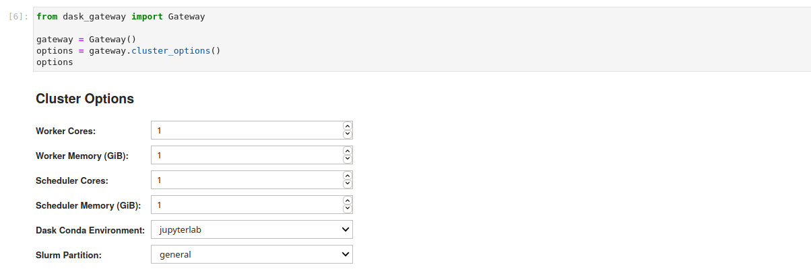
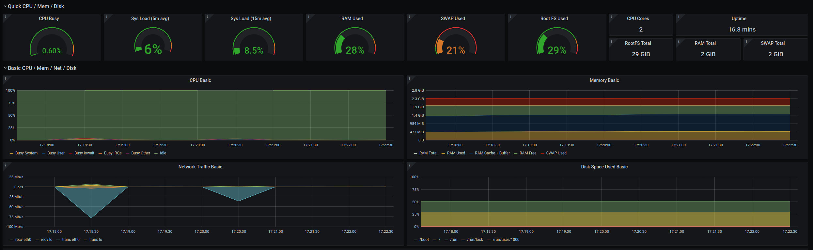

QHub OnPrem
-----------

QHub OnPrem is an opinionated open source deployment of
`jupyterhub <https://jupyterhub.readthedocs.io/en/stable/>`_ based on an
HPC jobscheduler. QHub OnPrem is a "distribution" of these packages
much like `Debian <https://www.debian.org/>`_ and
`Ubuntu <https://ubuntu.com/>`_ are distributions of
`Linux <https://en.wikipedia.org/wiki/Linux>`_. The high level goal of
this distribution is to form a cohesive set of tools that enable:
 - environment management via `conda
   <https://docs.conda.io/en/latest/>`_ and `conda-store
   <https://github.com/Quansight/conda-store>`_
 - monitoring of compute infrastructure and services
 - scalable and efficient compute via `jupyterlab
   <https://jupyterlab.readthedocs.io/en/stable/>`_ and `dask
   <https://dask.org/>`_
 - deployment of jupyterhub on prem without requiring deep devops
   knowledge of the Slurm/HPC and jupyter ecosystem

Features
========

 - Scalable compute environment based on the
   `Slurm <https://slurm.schedmd.com/overview.html>`_ workload manger to
   take advantage of entire fleet of nodes
 - Ansible based provisioning on Ubuntu 18.04 and Ubuntu 20.04 nodes
   to deploy one master server and `N` workers. These workers can be
   pre-existing nodes in your compute environment
 - Customizable Themes for JupyterHub

.. image:: _static/images/qhub-landing-page.png
   :alt: jupyterhub-theme

 - JupyterHub integration allowing users to select the memory, cpus,
   and environment that jupyterlab instances for users are launched in

.. image:: _static/images/qhub-jupyterlab-profile.png
   :alt: jupyterhub profile

 - Dask Gateway integration allowing users to selct the memory, cpus,
   and environment that dask schedule/workers use

 - Monitoring of entire cluster via `grafana <https://grafana.com/>`_
   to monitor the nodes, jupyterhub, slurm, and traefik

 - Shared directories between all users for collaborative compute

Table of Contents
=================

.. toctree::
   :maxdepth: 2
   :caption: Contents:

   overview
   architecture
   conda
   ansible
   benchmark
   dashboards
   dask
   jupyterhub
   slurm
   backup
   faq

Indices and tables
==================

* :ref:`genindex`
* :ref:`modindex`
* :ref:`search`
